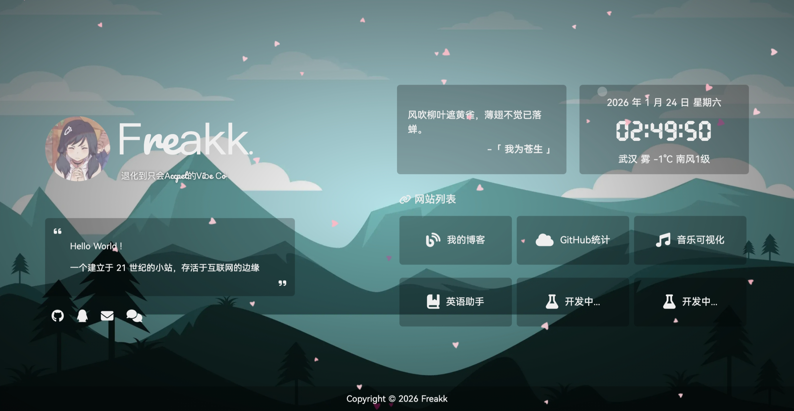

<div align="center">
  
  <h1>Personal Page (Vue Refactor)</h1>
  <p>
    A modern, high-performance personal homepage refactored with <b>Vue 3</b> + <b>Vite</b>.
  </p>
  
  <p align="center">
    <span>English</span> | <a href="./README.md">简体中文</a>
  </p>

  <p>
    <a href="https://vuejs.org/">
      
    </a>
    <a href="https://vitejs.dev/">
      
    </a>
    <a href="https://getbootstrap.com/">
      
    </a>
    <a href="https://github.com/Freakz3z/Personal-Page/blob/main/LICENSE">
      
    </a>
  </p>
</div>

---

<div align="center">
    
</div>

## 📖 Introduction

This is a minimalist, aesthetic, and feature-rich personal homepage. Originally built with HTML/jQuery, it has been completely rewritten using **Vue 3 Composition API** + **Vite**.
It integrates functionalities like a music player, guestbook, real-time weather, time capsule, and dynamic particle backgrounds, all deeply optimized for a silky-smooth experience on both desktop and mobile devices.

## ✨ Features

### 🎨 Visual & UI
- **⚡️ Modern Stack** - Built with Vue 3 + Vite for instant load times and rapid development.
- **📱 Responsive Design** - Perfectly adapts to all screen sizes, offering an immersive full-screen experience on mobile.
- **💎 Glassmorphism** - Global **iziToast** notification system customized with frosted glass effects for sophisticated feedback.
- **⌨️ Identity Typewriter** - Features a `Typed.js` integration under the logo to cyclically display your multiple identities (e.g., Student, Developer).

### 🛠 Utilities
- **🎵 Immersive Music** - Integrated player with a dedicated lyrics panel, progress dragging, highlighting, and support for Netease/Tencent playlists.
- **🌦 Real-time Weather** - Automatically detects location and displays weather info with "Updating..." interactive feedback.
- **⏳ Time Capsule** - Visualizes the progress of the current day, week, month, and year to remind you to cherish every moment.
- **💬 Message Board** - **Giscus** powered comment system (GitHub Discussions based), secure and database-free.
- **🔗 Social Hub** - Smart aggregation of your social links (GitHub, Email, Telegram, etc.).

### ⚙️ System
- **🌸 Dynamic Background** - Upgraded Canvas-based "Sakura Falling" effect with physics simulation.
- **🖼 Wallpaper Switching** - Supports Local, Bing Daily, Random Anime, and Random Landscape modes with preference persistence.
- **🔧 Easy Config** - All configurations are centralized in `setting.json`. No code changes needed for personalization.

## 🚀 Quick Start

### Prerequisites
- Node.js > 16.0
- npm / yarn / pnpm

### 1. Clone
```bash
git clone https://github.com/Freakz3z/Personal-Page.git
cd Personal-Page
```

### 2. Install
```bash
npm install
```

### 3. Dev Server
```bash
npm run dev
```

### 4. Build
```bash
npm run build
```
Output files will be in `dist`.

## 📂 Project Structure

```
Personal-Page/
├── src/
│   ├── assets/             # Assets (css, img, fonts)
│   ├── components/         # Vue Components
│   │   ├── Background.vue  # Canvas Background
│   │   ├── MusicPlayer.vue # Player Logic
│   │   └── MessageBoard.vue# Giscus wrapper
│   ├── composables/        # Composition API Hooks
│   │   ├── useTime.js      # Time Logic
│   │   └── useWeather.js   # Weather Logic
│   ├── App.vue             # Main Entry
│   └── main.js             # Vue Init
├── setting.json            # Global Config
└── README_EN.md
```

## ⚙️ Configuration

Customization is easy via `setting.json` in the root directory.

### Config Example
```json
{
    "title": "My Homepage",
    "description": "Meta Description",
    "author": "Freakk",
    
    // Typewriter Text
    "who_am_i_1": "Student",
    "who_am_i_2": "Developer",
    "who_am_i_3": "Dreamer",

    // Socials
    "github": "Freakz3z",
    "email": "your@email.com",
    
    // Music (Meting API)
    "music_server": "netease",      // netease, tencent
    "music_type": "playlist",       // playlist, song
    "music_id": "3778678",          // Playlist ID
    
    // Custom Links
    "link_1": ["https://blog.com", "fa-solid fa-blog", "My Blog"]
}
```

## ☁️ Deployment

**Vercel** is recommended:
1. Fork this repo.
2. Import to Vercel.
3. Select `Vite` preset.
4. Deploy.

## 📄 License

MIT License © 2026 Freakk
